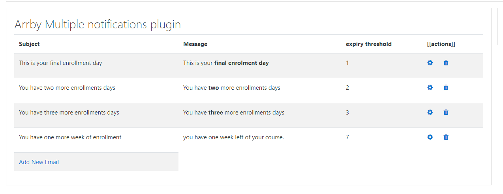
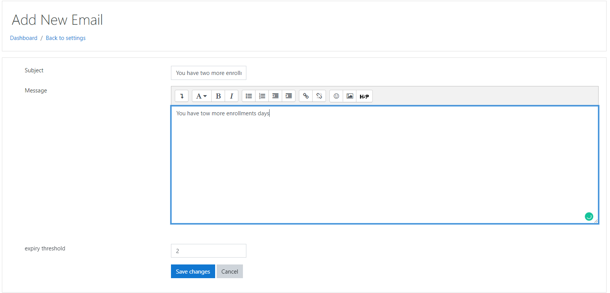

Moodle "Multiple notifications"
===============================

Arrby Multiple notifications is Moodle's plugin that allows you to send a reminder to the enrolled student before the enrollment period has expired.

Documentation
=============

Placeholder replacement

- [firstname] -> Student first name
- [lastname] -> Student last name
- [coursename] -> course name
- [timeend] -> time enrollment end
- [timestart] -> time enrollment start
- [time] -> current datetime 

Developed and maintained by
===========================
Hernan Arregoces
 - Software Engineer

Moodle profile: https://moodle.org/user/profile.php?id=1931915

Linkedin: https://www.linkedin.com/in/hernanarregoces/

Installation
------------

**First way**

- Clone this repository into the local folder.

**Second way**

- Download this repository
- Extract the content
- Put the folder into the local folder of your moodle
